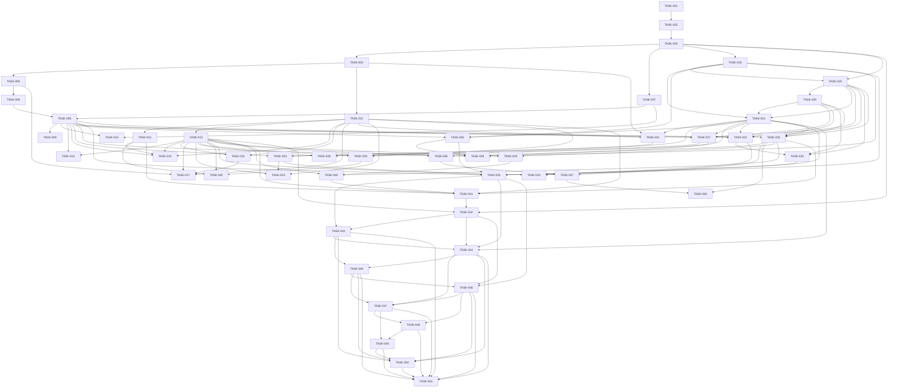

# Dependency Graph

```mermaid
graph TD
  TASK-001
  TASK-001 --> TASK-002
  TASK-002 --> TASK-003
  TASK-003 --> TASK-004
  TASK-004 --> TASK-005
  TASK-005 --> TASK-006
  TASK-003 --> TASK-007
  TASK-006 --> TASK-008
  TASK-007 --> TASK-008
  TASK-008 --> TASK-009
  TASK-007 --> TASK-010
  TASK-008 --> TASK-010
  TASK-004 --> TASK-011
  TASK-011 --> TASK-012
  TASK-011 --> TASK-013
  TASK-008 --> TASK-014
  TASK-013 --> TASK-014
  TASK-008 --> TASK-015
  TASK-011 --> TASK-015
  TASK-012 --> TASK-015
  TASK-013 --> TASK-015
  TASK-011 --> TASK-016
  TASK-013 --> TASK-016
  TASK-005 --> TASK-017
  TASK-011 --> TASK-017
  TASK-013 --> TASK-017
  TASK-016 --> TASK-017
  TASK-003 --> TASK-018
  TASK-003 --> TASK-019
  TASK-018 --> TASK-019
  TASK-019 --> TASK-020
  TASK-018 --> TASK-021
  TASK-019 --> TASK-021
  TASK-020 --> TASK-021
  TASK-004 --> TASK-022
  TASK-011 --> TASK-022
  TASK-021 --> TASK-022
  TASK-008 --> TASK-023
  TASK-021 --> TASK-023
  TASK-022 --> TASK-023
  TASK-011 --> TASK-024
  TASK-013 --> TASK-024
  TASK-023 --> TASK-024
  TASK-008 --> TASK-025
  TASK-018 --> TASK-025
  TASK-021 --> TASK-025
  TASK-008 --> TASK-026
  TASK-018 --> TASK-026
  TASK-021 --> TASK-026
  TASK-025 --> TASK-026
  TASK-008 --> TASK-027
  TASK-019 --> TASK-027
  TASK-020 --> TASK-027
  TASK-021 --> TASK-027
  TASK-013 --> TASK-028
  TASK-027 --> TASK-028
  TASK-011 --> TASK-029
  TASK-013 --> TASK-029
  TASK-027 --> TASK-029
  TASK-012 --> TASK-030
  TASK-013 --> TASK-030
  TASK-029 --> TASK-030
  TASK-008 --> TASK-031
  TASK-019 --> TASK-031
  TASK-020 --> TASK-031
  TASK-021 --> TASK-031
  TASK-019 --> TASK-032
  TASK-020 --> TASK-032
  TASK-031 --> TASK-032
  TASK-013 --> TASK-033
  TASK-031 --> TASK-033
  TASK-032 --> TASK-033
  TASK-008 --> TASK-034
  TASK-018 --> TASK-034
  TASK-021 --> TASK-034
  TASK-023 --> TASK-034
  TASK-025 --> TASK-034
  TASK-008 --> TASK-035
  TASK-019 --> TASK-035
  TASK-020 --> TASK-035
  TASK-021 --> TASK-035
  TASK-013 --> TASK-036
  TASK-035 --> TASK-036
  TASK-035 --> TASK-037
  TASK-036 --> TASK-037
  TASK-035 --> TASK-038
  TASK-037 --> TASK-038
  TASK-013 --> TASK-039
  TASK-035 --> TASK-039
  TASK-013 --> TASK-040
  TASK-035 --> TASK-040
  TASK-039 --> TASK-040
  TASK-011 --> TASK-041
  TASK-012 --> TASK-041
  TASK-013 --> TASK-041
  TASK-035 --> TASK-041
  TASK-040 --> TASK-041
  TASK-003 --> TASK-042
  TASK-013 --> TASK-042
  TASK-041 --> TASK-042
  TASK-034 --> TASK-043
  TASK-042 --> TASK-043
  TASK-021 --> TASK-044
  TASK-034 --> TASK-044
  TASK-042 --> TASK-044
  TASK-043 --> TASK-044
  TASK-043 --> TASK-045
  TASK-044 --> TASK-045
  TASK-034 --> TASK-046
  TASK-042 --> TASK-046
  TASK-045 --> TASK-046
  TASK-044 --> TASK-047
  TASK-045 --> TASK-047
  TASK-046 --> TASK-047
  TASK-046 --> TASK-048
  TASK-047 --> TASK-048
  TASK-047 --> TASK-049
  TASK-048 --> TASK-049
  TASK-043 --> TASK-050
  TASK-044 --> TASK-050
  TASK-045 --> TASK-050
  TASK-046 --> TASK-050
  TASK-049 --> TASK-050
  TASK-043 --> TASK-051
  TASK-044 --> TASK-051
  TASK-045 --> TASK-051
  TASK-046 --> TASK-051
  TASK-047 --> TASK-051
  TASK-048 --> TASK-051
  TASK-049 --> TASK-051
  TASK-050 --> TASK-051
```
